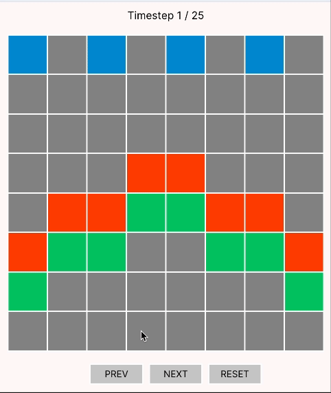
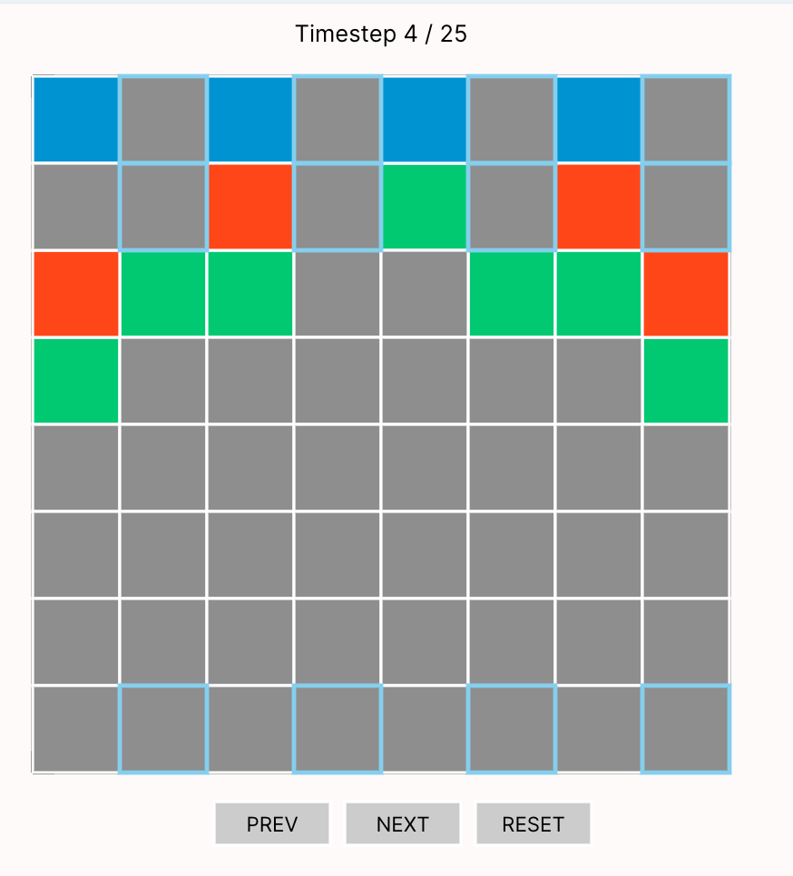
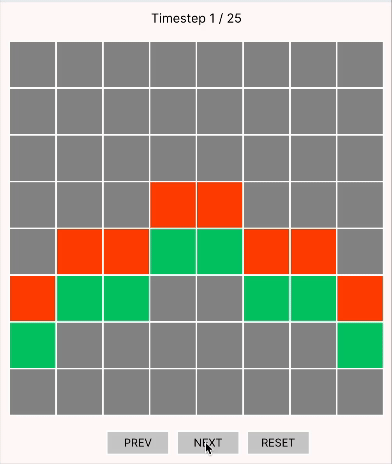
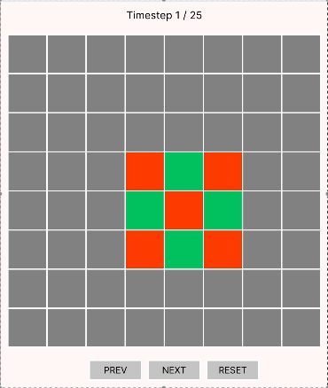

# Confection 🍬
**A Cellular Automata Approach to Disease Modeling** *Ishika Tulsian, Yali Sommer, and Zack Amiton*

We arrived at our project idea from two different angles: an interest in the cellular automata and extensions on the Game of Life (e.g. HighLife, [Brian's Brain](https://en.wikipedia.org/wiki/Brian%27s_Brain)) on the one hand, and epidemiological models like disease models like [SIR](https://en.wikipedia.org/wiki/Compartmental_models_in_epidemiology) on the other. 

These dual interest led us to create a series of cellular models, pairing **Temporal Forge** with a custom visualizer to explore the evolution of various toy "diseases" under varied configurations and introducing multiple complicating factors (death, vaccinations, recovery windows, ...).

<!-- feel free to replace w another random gif!! -->

Our goal with this project was largely exploratory rather than entering aiming to solve a specific sub-problem or find a "single" answer. Instead, as we investigated, we devised various hypotheses related to our diseases; as a sample:

* Can we find configurations which result in cyclic / "glider"-like behavior? 
* Can we find "common cold"-like configurations which infect every cell of our world, but do not ultimately result in deaths? 
* Can we find traces where vaccinated cells provide "herd immunity" to neighboring cells, stopping an infection from spreading?

...and so forth!

## Model Design: Decisions & Explorations

We initially began our model with a base ruleset, a slight modification of the classic Game of Life rules:

* **Susceptibility**: All cells, by default, are "susceptible," and are **infected if they have 2+ infected neighbors**
* **Incubation**: Infected cells *remain* infected if they have **3+ infected neighbors**
* **Recovery**: Infected cells *recover* if they have **2 or fewer infected neighbors**
* **Limited Immunity**: Recovered cells *return* to susceptibility after a single timestep

With these considerations, we decided to use `Temporal Forge` as a means to model extended traces, creating a `Simulation` sig to track the evolving state of a given trace, as well as a `Configuration` sig to either manually or programmatically define starting conditions for our various simulations (where `Configuration` directly determines the initial state for `Simulation`, via an `initState` predicate).

As our model builds on cellular automata, our "simulation" space is an n-by-n board, with `Simulation` maintaining a suite of `set Int -> Int` which correspond with row-column  indices, where, e.g. `(0 -> 0) in Simulation.recovered` would denote that cell `(0, 0)` is recovered in the current state. 

Simulation contains *base* sets `infected`, `susceptible`, and `recovered`, which we expanded to form our *core* sets, also including `dead` and `vaccinated` cells. Additionally, two *manager* sets are used (`incubation` mapping to `infected`, and `immunity` mapping to `recovered`) to track the number of states that cells have existed in another state, while a single *derived* set (`protected`) is used simply to surface information to our visualizer — perhaps a touch inelegant in overusing sets, but it works!

The state engine of our model is a family of **"timestep"** predicates, living in [confection-core.frg](./confection-traces.frg) which serve to simulate single iterations for a given configuration. We separated these up into distinct functions to enforce introduce different epidemiological constraints. Some key examples include:

* `timestep`: only uses the "base" ruleset, operating on `infected` and `recovered` cells
* `deadTimestep`: which introduces the notion of cells dying after remaining infected for 2 timesteps (tracked via `incubation`)
* `vaxTimestep`: introduces vaccinated cells, which provide herd immunity, "protecting" nearby cells adjacent to at 2 vaccinated cells
* `immunityTimestep`: introduces temporary immunity to recovered cells (tracked via `bounceback`)
* ...and more!

The current iteration of our model relies on an integer bitwidth of `3` (restricting to an 8-by-8 grid), down from the default of `4` (and hence, a 16-by-16 grid); we found that the runtime of instances (particulaly when considering our test suite) made the larger grid size frustrating, if not infeasible — however, we acknowledge that the arithmetic-heavy approach to our modeling choices (e.g. our neighbor computations) may have also exacerbated this. Additionally, the amount of work needed to shift back is relatively minor (simply increasing the bitwidth should be sufficient, given that none of our timestep function conditions rely on the expanded range of numbers).

One issue we _did_ encounter at both bitwidths was overflow considerations. While most cellular automata assume an infinite grid, the limited space of easily-representable indices when using `Int -> Int` for row-column identification meant that our grid size was limited by bitwidth. Hence, in order to create more interesting simulations, we used toroidal boundaries (a common restriction) such that border cells neighbor cells on the opposite side. 

However, we did encounter wraparound issues, where a grid-based simulation means that any given cell has precisely 8 neighbors, assuming rule evolution rulies on Moore neighborhood (which ours does). Hence, rather than using inequalities to check neighbors, we needed to check for presense / absence of specific values (since 8 neighbors for bitwidth 4 would be treated as -7, or as 0 under bitwidth 3). This also meant needing to modify our helpers to explicitly check whether a set was empty rather than simply its cardinality for bitwidth 3, as otherwise our evolution rules would not be able to distinguish having a full neighborhood from having no neighborhood.

Another limitation around from our use of Temporal Forge, as lasso traces aren't necessarily ideal for cellular automata modeling. For example, the Game of Life is famous for exhibiting chaotic, emergent behavior; while our model follows a different suite of rules, it too evolves rather chaotically. We decided to use a *timestamp* system that allowed us to add a "cutoff" point to our configuration, after which any timestep being used would simply do nothing (and force an "explicit" lasso point, even in traces that didn't necessarily exhibit periodic behavior). While we later modified this via partial traces, the underlying intuition remains the same.

### TODO: ADD ANYTHING THAT FEELS LIKE IT ADDRESSES THESE BETTER

**What tradeoffs did you make in choosing your representation? What else did you try that didn’t work as well?**

**What assumptions did you make about scope? What are the limits of your model?**

## Testing

### TODO

## Interpreting Results

We created a custom visualizer to support stepping through the iterations of a given simulation, which maps the members of each set to its corresponding, colored grid cell:

    

* **Grey** cells correspond with `susceptible` cells
* **Red** cells correspond with `infected` cells
* **Green** cells correspond with `recovered` cells
* **Black** cells correspond with `dead` (these should remain present after appearing in a simulation)
* **Blue** cells correspond with `vaccinated` cells (these should remain fixed thorughout a simulation)
    * *Blue-Outlined* cells correspond with `protected` cells, which cannot be infected

Additionally, a label at the top of the visualizer notes the current timestep, and buttons at the bottom allow for time to be progressed or reset. 

An instance of the model under a given run finds a simulation that meets all the provided criteria: for example, if the condition being searched for was a model that lasts at least some number of iterations without any cells dying, then a satisfying example would show the evolution of that desired model. Conversely, an _unsat_ result would suggest that, for the given criteria being searched for, no such model exists. 

## Goals & Findings
<!-- # TODO: Ishika & Yali...good luck 🙏 -->
<!-- # Basically: for every trace that is interesting, formulate a hypothesis that seems marginally interesting ("can we find a trace where ..." and then attach the relevant gif + name the trace that exhibits that behavior) -->
Our goal from the outset was not to prove a specific theorem or simulate a real-world disease, but rather to explore the expressive capacity of cellular automata-based disease models using formal methods. Specifically, we sought to understand the kinds of dynamic, emergent behaviors we could model from a relatively simple and deterministic rule set. As we iterated on our model, we were able to achieve all our foundational and target goals we set out in our project proposal, as well as implement the additional `dead` and `vaccinated` states which were described in our reach goal. These extensions allowed us to experiment with a much richer space of epidemiological behaviors, going beyond simple infection-recovery loops. Over the course of the project, we designed and successfully generated a diverse suite of traces, including but not limited to:

* **Gliders**: 
    _Guiding Questions_: Could we find an initial configuration that led to self propagating infection clusters reminiscent of GoL gliders? If so, is there a way we get use `vaccinated` states to stop the spread of infection through such a glider? 

    _Relevant Traces_: `workingGliderSmallTrace`, `workingGliderBigTrace`, `gliderVaxWallTrace`

    We were able to find traces where the shape of infection spread wouldn't change but instead just move vertically forever. `workingGliderSmallTrace` and `workingGliderBigTrace` were implemented using our `timestep` predicate, and `gliderVaxWallTrace` was implemented using `vaxTimestep` to allow for `vaccinated` and `protected` states. 

    
    

    Interestingly, we see that only 4 cells need to be vaccinated in order to provide a 'herd immunity' effect to their surrounding cells, stopping the infection glider from persisting!

* **Oscillators**:
    _Guiding Questions_: Can we generate configurations that repeat indefinitely without reaching a fixed point? Can we find a system where there is a periodic infection pattern?

    _Relevant Traces_: `checkerboardTrace`, `oscillatorTrace`

    Using `checkerboardTrace` we were able to find a period-3 oscillator following the `timestep` ruleset!

    

## Further Avenues

#### TODO what else would we do given infinite time / more effort?

## Due Credit

* Andrew Wagner + Tim's [Forge Game of Life implementation](https://github.com/tnelson/Forge/blob/main/forge/examples/basic/gameOfLife.frg) was invaluable as a reference point for our initial explorations — we built out our [`conway.frg`](./conway/conway.frg) based on this!
* Andrew's [senior thesis](https://cs.brown.edu/media/filer_public/1a/cd/1acd447b-1807-48c6-adf0-beef35a7b564/wagnerandrew.pdf) on synthesizing initial configuration served as a great source of inspiration (and is just a very cool read!), though we mostly heeded his warnings and stayed away from non-determinism :)
* Brian (of [Brian's Brain](https://www.msevans.com/automata/briansbrain.html)) for his brain (which we also implemented in [`confection-old.frg`](./confection-old.frg)) 
